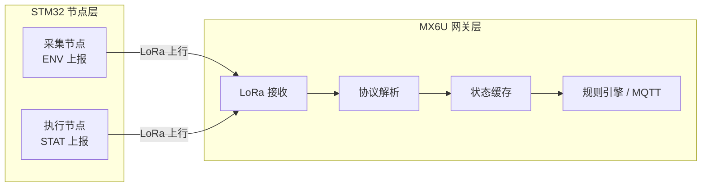

# 智慧农业大棚总体纲要

## 1. 当前范围

本文档当前只约束 `LoRa 上行方向`：

- 采集节点上报环境数据
- 执行节点上报设备状态
- MX6U 作为统一接收端解析并入库/决策

下行控制链路本轮仅保留兼容实现，不作为本文档主范围。

## 2. 系统分层



| 层级           | 节点                          | 当前职责                       |
| -------------- | ----------------------------- | ------------------------------ |
| STM32 采集节点 | 传感器采样、LoRa 环境上报     | 周期发送 `ENV` 帧              |
| STM32 执行节点 | 执行器状态维护、LoRa 状态上报 | 周期发送 `STAT` 帧             |
| MX6U           | LoRa 接收与解析               | 区分采集节点与执行节点的数据源 |

## 3. STM32 双角色约定

单一工程 `发送端` 同时支持两种角色，通过编译期宏切换：

- `APP_NODE_ROLE_SENSOR`：采集节点
- `APP_NODE_ROLE_EXECUTOR`：执行节点
- `APP_NODE_ID`：节点编号
- `APP_NODE_DOWNLINK_COMPAT`：执行节点是否保留下行兼容控制

默认配置位于 [app_node_role.h](d:\STM32Project\智慧农业大棚\发送端\Core\Inc\app_node_role.h)。

### 3.1 采集节点

采集节点负责环境上报，当前上报字段为：

- 温度 `T`
- 湿度 `H`
- 土壤湿度 `SOIL`
- 光照原始值 `L`
- 二氧化碳 `CO2`

当前 STM32 固件中：

- DHT11 提供温湿度
- ADC 提供光照原始值
- `CO2` 通过 `USART3` 串口模块接入
- `SOIL` 字段已保留在协议与数据结构中，默认沿用最近值，等待独立土壤湿度传感器接入

### 3.2 执行节点

执行节点负责设备状态上报，当前状态字段为：

- 风扇 `F`
- 水泵 `P`
- 补光灯 `LED`

当前硬件映射采用“一真两模拟”：

- 风扇：`MOTOR_*` 输出
- 水泵：`LED1`
- 补光灯：`LED2`
- `LED3`：保留为调试/心跳，不进入协议

## 4. 上行协议

### 4.1 采集节点环境帧

```text
ENV,N=<node_id>,T=<temperature>,H=<humidity>,SOIL=<soil_moisture>,L=<light_raw>,CO2=<co2_ppm>
```

字段说明：

- `N`：采集节点编号
- `T`：温度，单位摄氏度，保留 1 位小数
- `H`：湿度，单位 `%RH`，保留 1 位小数
- `SOIL`：土壤湿度字段，当前为协议预留
- `L`：光照 ADC 原始值
- `CO2`：二氧化碳浓度，单位 `ppm`

示例：

```text
ENV,N=1,T=25.3,H=60.1,SOIL=41.2,L=1234,CO2=567
```

### 4.2 执行节点状态帧

```text
STAT,N=<node_id>,F=<ON|OFF>,P=<ON|OFF>,LED=<ON|OFF>
```

示例：

```text
STAT,N=2,F=ON,P=OFF,LED=ON
```

## 5. MX6U 侧最小解析模型

建议在网关侧按帧类型拆分：

```c
typedef struct {
    int node_id;
    float temp;
    float hum;
    float soil;
    int light;
    int co2;
} env_report_t;

typedef struct {
    int node_id;
    int fan_on;
    int pump_on;
    int fill_light_on;
} status_report_t;
```

这样可以避免把采集数据与执行状态混在同一张表或同一套字段中。

## 6. 边缘计算与自主决策

### 6.1 MX6U 的边缘计算职责

MX6U 不只是做 LoRa 转发，还负责在网关侧完成以下边缘计算任务：

- 对 `ENV` 与 `STAT` 两类上行帧进行解析、分类和缓存
- 将环境数据与设备状态进行关联，形成当前大棚运行状态
- 按阈值规则做本地判断，不依赖云端即可先执行基础控制
- 将关键状态、报警信息和预测结果通过 MQTT 上传

### 6.2 当前自主决策逻辑

当前自主决策主要放在 MX6U 侧规则引擎中，核心思路是"**本地先判断，本地先响应**"。

| **决策类型** | **输入**              | **判断条件**                       | **动作**           |
| ------------ | --------------------- | ---------------------------------- | ------------------ |
| 温度控制     | `ENV.T` • `STAT.F`    | 温度 > 35℃                         | 下发开风扇命令     |
| 降温停止     | `ENV.T` • `STAT.F`    | 温度 < 30℃                         | 下发关风扇命令     |
| 灌溉控制     | `ENV.SOIL` • `STAT.P` | 土壤湿度低于阈值                   | 开启水泵并延时复查 |
| 补光控制     | `ENV.L` • `STAT.LED`  | 光照低于阈值且处于白天工作时段     | 开启补光灯         |
| 节点离线检测 | 节点最近上报时间      | 超过设定时间未收到 `ENV` 或 `STAT` | 标记离线并报警     |

### 6.3 边缘智能的扩展方向

当前文档先收敛在 LoRa 上行模型，但 MX6U 仍保留进一步扩展边缘智能的空间：

- **趋势预测**：根据最近一段时间温度序列预测未来 5 分钟变化趋势
- **提前干预**：在即将超温前先启动风扇，而不是等超阈值后再处理
- **多源融合**：将环境数据、设备状态、视觉结果联合用于决策
- **异常检测**：例如风扇已开启但温度持续不降，判定设备或环境异常

### 6.4 简单视觉 OpenCV

为了保留一个轻量、可落地的视觉入口，MX6U 可外挂 USB 摄像头并结合 OpenCV 做基础图像处理，当前建议只做简单功能，不引入复杂识别模型。

- **亮度检测**：计算图像平均灰度，辅助判断环境是否过暗，配合补光控制
- **绿色覆盖率**：在 HSV 空间提取绿色区域，粗略反映植株覆盖情况
- **运动检测**：基于相邻帧差分，判断画面是否存在明显运动
- **画面异常检测**：检测过暗、模糊、遮挡等异常情况，作为摄像头健康状态参考

**建议输出字段：**

- `brightness`：平均亮度
- `green_ratio`：绿色区域占比
- `motion_flag`：是否检测到运动
- `vision_ok`：画面是否正常

**当前定位：**

- 视觉结果作为**辅助信息**参与决策
- 不替代温湿度、土壤湿度、光照等主传感器链路
- 优先用于补光辅助判断、异常检测和后续展示

### 6.5 当前定位

因此，目前系统可以概括为：

- STM32 负责**采集**和**状态上报**
- MX6U 负责**边缘计算**和**自主决策**
- MQTT 负责**上云展示与远程衔接**

## 7. 当前实现说明

- STM32 上报周期默认 5 秒
- 采集节点构建后只发送 `ENV`
- 执行节点构建后只发送 `STAT`
- 当前 `T/H` 来自 DHT11 单总线
- 当前 `CO2` 来自 `USART3` 串口模块
- 当前 `SOIL` 字段为协议预留字段，等待独立土壤湿度传感器接入
- 执行节点可通过 `APP_NODE_DOWNLINK_COMPAT` 保留下行兼容逻辑，避免影响现有联调链路
- 详细字段与兼容说明见 [lora通信协议.md](d:\STM32Project\智慧农业大棚\文档\接口文档\lora通信协议.md)
